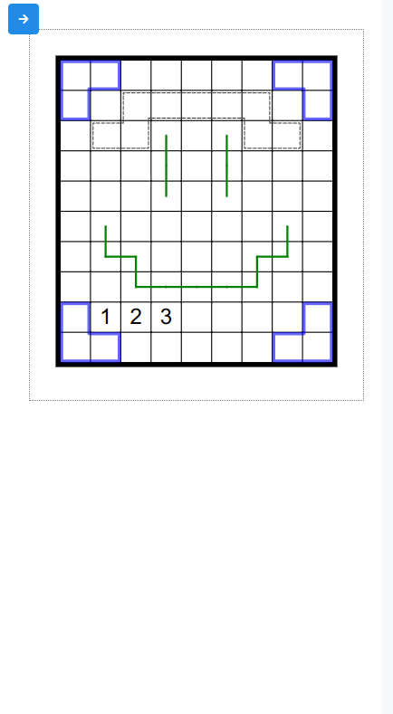
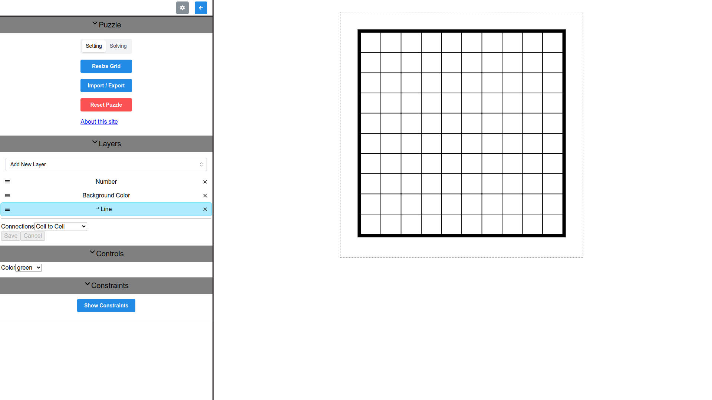

# Latgrid

Presenting latgrid! An web app built to set puzzles of classic variants or allow you to create your own. Try it now on your phone or computer at https://latgrid.vercel.app

## Status

Latgrid is currently in development. While most planned features and ideas are in a private notebook at the moment (mostly for personal convenience), you can look at some of the notes that made their way into an issue by checking the issues tab. Here's a quick checklist of some things that are or will be implemented.

-   [x] A few common tools (tentatively called layers) to draw numbers, lines, killer cages, etc.
-   [x] Exporting puzzles to share with others with simple answer check.
-   [x] Easier editing of large grids on mobile.
-   [ ] Hex grids, triangular grids, etc.
-   [ ] Dark theme, Colorblind theme.
-   [ ] Managing your library of puzzles in a single tab with an export to/import from file feature.
-   [ ] Multiple grids in a single puzzle separate or joined with portals or wrapping edges.
-   [ ] Programmable constraints so that the rules of your custom puzzle variant don't have to be imagined but can actually be enforced.
-   [ ] ~~General Artificial Intelligence paperclip generator.~~ That will have to wait for a different project.

## Why make another tool?

There are many other tools out there for setting puzzles, but most are to make specific genres (you cannot create your own variant). Penpa+ is an exception to this, but it has a few problems that made me still want to create a separate tool, most of which are technical.

-   It has to support legacy urls. This is not a bad thing in and of itself (it's a very good thing since it means it is a success), but it does mean some tricks for shortening urls are not possible.
-   It uses canvas instead of svg or dom elements. This means you don't have access to css to style elements and image scaling becomes much more of a problem. Additionally, you can't get true dark mode.
-   It uses global scope js instead of modules making it hard to write tests. I contributed some code that expanded the amount of puzz.link puzzles that could be imported into penpa and had to go through some hoops just to set up a few snapshot tests.
-   You can't use typescript. While some would consider that a plus, having typescript and other linting tools help catch certain mistakes early and often makes refactoring much easier.

That all said, Latgrid will not replace Penpa+. It has some nice features that make it a better choice, e.g. everything is pure javascript meaning you can clone the project and run it locally without any build steps.
